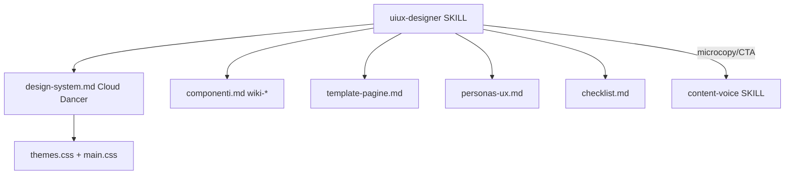

## Agente UI/UX + base visuale Cloud Dancer

Due deliverable: (A) la skill/agente UI-UX documentale; (B) il refactor dei token CSS attivi per portare il sito su base Cloud Dancer. La skill rispecchia la struttura di [/var/www/liberating.it/.cursor/skills/uiux-designer/SKILL.md](/var/www/liberating.it/.cursor/skills/uiux-designer/SKILL.md) ma è ancorata alla realtà di questo progetto (token Material 3 in `themes.css`, componenti `wiki-*`/`card`/`style-section`, font Lato+Playfair, tema light-only, 6 personas).

### Principio chiave di coerenza
La skill `content-voice` esiste già e governa i testi. La nuova skill `uiux-designer` governa SOLO struttura, layout, componenti, colore, accessibilità — e rimanda a `content-voice` per microcopy/CTA. Regola di conflitto: accessibilità e leggibilità > decorazione; `content-voice` > copy UI.

## A. Palette Cloud Dancer (base visuale)

Cloud Dancer (PANTONE 11-4201 TCX) ≈ `#F0EEE9` (off-white caldo). Diventa il colore di **sfondo pagina**; le superfici/card salgono verso un bianco più luminoso per creare elevation morbida senza ombre pesanti. Si mantengono gli accenti verde-beige naturali già coerenti col brand.

Scala proposta (warm off-white, WCAG AA con testo near-black):
- `--md-sys-color-background`: `rgb(240 238 233)` (Cloud Dancer)
- `--md-sys-color-surface`: `rgb(248 246 241)` (card/superfici, leggermente più chiare del bg)
- `surface-container-lowest`: `rgb(252 251 247)` → `surface-container-highest`: `rgb(236 233 226)` (scala dim→bright invertita per off-white)
- Primary invariato `rgb(60 110 85)` (verde naturale); on-surface invariato near-black per contrasto massimo.

## B. Struttura della skill

Cartella `.cursor/skills/uiux-designer/` con progressive disclosure (come la skill di riferimento e come `content-voice`):

- `SKILL.md` (master): quando usarla, principi UX prioritari, mappa personas→UX, tabella tipi pagina, workflow, integrazione con `content-voice`, "cosa NON fare", checklist finale.
- `design-system.md`: token Material 3 reali + **palette Cloud Dancer**, tipografia (Lato 400/700 body, Playfair Display heading), type scale, spacing 4dp, radius, elevation morbida, motion, breakpoint (600/960/1280), accenti 4 stili.
- `componenti.md`: spec dei componenti reali del progetto (`hero`, `card`/`card--accent`/`card--elevated`, `style-section--{secure,anxious,avoidant,disorganized}`, `wiki-image`, `banner-*`, `btn`/`btn-primary`, header `nav-*`, `topbar`/`breadcrumb`, `site-footer`, `grid-2/3`) con stati focus/hover e note ARIA.
- `template-pagine.md`: layout per tipo pagina (homepage/landing, test, profilo stile, storie reali, esercizi, approfondimenti, libri, legale) allineato ai cluster di `content-voice`.
- `personas-ux.md`: journey e priorità UX per le 6 personas (Chiara prioritaria, poi Luca/Marco/Sofia/Elena/Andrea), con implicazioni concrete (mobile-first, una CTA primaria, scannability, empatia visiva).
- `checklist.md`: revisione UI/UX + accessibilità WCAG 2.1 AA (contrasto, focus, keyboard, reduced-motion) + performance (WebP, lazy, preload) + obbligo 2 immagini per nuova pagina (regola `.cursorrules`).

Più il puntatore rule `.cursor/rules/uiux-designer.mdc` (stesso pattern di [.cursor/rules/content-voice.mdc](/var/www/stiliattaccamento/.cursor/rules/content-voice.mdc)).

## C. Refactor CSS (adozione Cloud Dancer)

- [public/css/themes.css](public/css/themes.css): aggiornare il blocco token `--md-sys-color-background`/`-surface`/`-surface-variant`/`surface-container-*` da bianco puro a scala Cloud Dancer (l'unico file token caricato in produzione insieme a `main.css`).
- [public/css/main.css](public/css/main.css): sostituire `body { background-color: rgb(255, 255, 255); }` (riga ~79) con il token `var(--color-bg-primary)`; rivedere le ~12 occorrenze di bianco hardcoded usando i token dove rappresentano sfondo/superficie (lasciando `on-primary`/testo su accento dove serve bianco reale).
- [public/css/light.css](public/css/light.css): allineare per coerenza documentale (anche se non linkato), così resta la fonte "canonica" dei token light.
- `<meta name="theme-color">`: lasciare il verde `#3c6e55` (chrome browser); valutare in checklist se passarlo a Cloud Dancer.

## Diagramma relazioni skill

## Note / decisioni prese
- Naming: si riusano i nomi classe esistenti (`wiki-*`, `card`, `style-section`), NON si introduce un prefisso `ls-*` (sarebbe estraneo a questo progetto).
- Tema: resta light-only forzato; nessuna dark mode reintrodotta.
- Cloud Dancer applicata come sfondo/superficie; accenti verde-beige e colori dei 4 stili invariati.