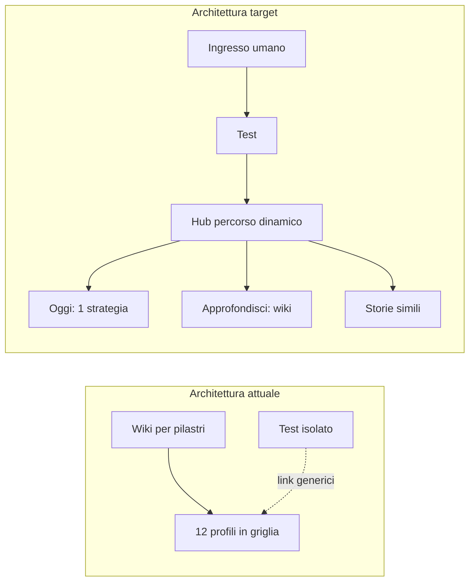
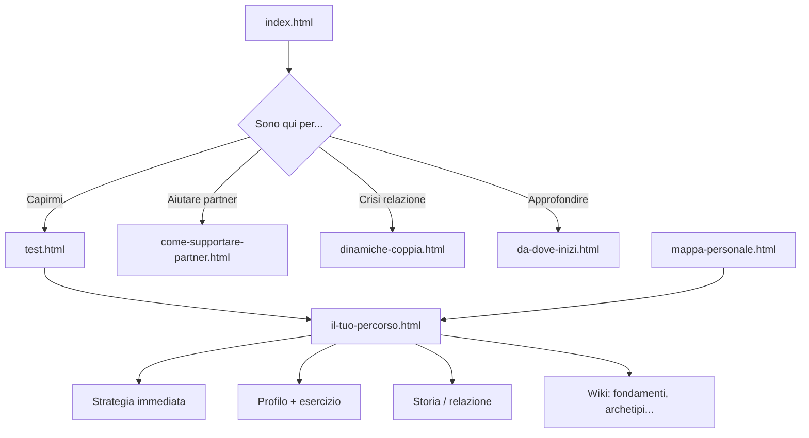

# Architettura allineata alla voce narrante (content-voice)

## Diagnosi: disallineamenti attuali

L'architettura **implementata** (nav in [`public/templates/header.html`](public/templates/header.html), mappa in [`public/sitemap.md`](public/sitemap.md)) è **tassonomica**: organizza per tipo di contenuto (Fondamenti, 4 Stili, Archetipi, 12 Profili, Approfondimenti…).

La skill [`content-voice`](.cursor/skills/content-voice/SKILL.md) e le job stories di Chiara ([`jtbd/job-stories.md`](jtbd/job-stories.md)) descrivono invece un **percorso emotivo**: capire → riconoscersi → fare qualcosa di concreto → sentirsi meno solo.



### Tensioni specifiche

| Area | Stato attuale | Voce content-voice |
|------|---------------|-------------------|
| Navigazione | Etichette accademiche ("Fondamenti", "Modello a Gradienti", Title Case) | Linguaggio da compagno ("Le basi", "Quanto è intenso per te") |
| Homepage | Griglia 12 profili prima che Chiara sappia chi è | Invito al test + percorsi per momento |
| Post-test | Lista testuale generica in [`test-surveyjs.js`](public/js/test-surveyjs.js) L411-416 | 3 passi concreti con link, tono EFT |
| Template profili | [`TEMPLATE-PROFILO.md`](public/profili/TEMPLATE-PROFILO.md): archetipo prima della pratica | Strategie immediate → comprensione → archetipo breve |
| Esercizi | Blocco autopoietico/Process Work in cima a [`esercizi.html`](public/js/esercizi.html) | 70% pratico; teoria avanzata in sezione collassabile |
| Documentazione legacy | [`docs/architettura-sito-wiki.md`](docs/architettura-sito-wiki.md) sezione "GUARIGIONE E CRESCITA" | "Percorso di consapevolezza" (già parzialmente in [`approfondimenti/crescita.html`](public/approfondimenti/crescita.html)) |
| Percorso utente | Specificato in architettura (L274-292) ma **non implementato** | Hub dinamico + progressione settimanale |

Il flusso dati esiste già: `localStorage.testResults` (test) e mappa in [`mappa-personale.js`](public/js/mappa-personale.js). Manca il **layer di navigazione narrativa** che li trasforma in percorso.

---

## Proposta: doppio livello IA

**Livello 1 — Percorso** (default per Chiara): dove sono, cosa fare ora, cosa leggere dopo.

**Livello 2 — Wiki** (per Elena/Andrea): tassonomia completa, invariata negli URL ma riorganizzata in nav secondaria.



---

## Variazioni architetturali proposte

### 1. Nuova pagina hub dinamica: `il-tuo-percorso.html`

Hub centrale post-test che legge `localStorage.testResults` e mostra:

- **Saluto contestuale** in tono compagno ("Ok, vediamo insieme da dove partire")
- **Il tuo profilo** (stile + livello) con link diretto a `profili/{stile}-{livello}.html`
- **3 prossimi passi** ordinati (non lista generica), con CTA:
  1. Una strategia da fare oggi (anchor su profilo o esercizio da 2 min)
  2. Un pezzo di comprensione EFT (breve testo + link profilo sezione "cosa succede nel ciclo")
  3. Una storia o dinamica di coppia pertinente
- **Disclaimer** sobrio se livello alto / oscillante
- **Fallback** se nessun test: invito gentile al test + percorsi statici per persona

**Modulo JS condiviso**: `public/js/modules/journey-hub.js`
- Input: `{ primaryStyle, level }` da test o `resolveProfileStyle()` da mappa
- Output: config percorso da `public/js/modules/journey-config.js` (JSON/JS con step per ogni combinazione stile×livello)
- Riutilizzato da: `test-surveyjs.js`, `mappa-profile-render.js`, eventuale banner sitewide

### 2. Pagina statica ingresso: `da-dove-inizi.html`

Per chi non ha fatto il test. Quattro card in voce narrante (non tassonomia):

| Card | Destinazione | Persona |
|------|--------------|---------|
| "Voglio capire cosa mi succede nelle relazioni" | test.html | Chiara |
| "Il partner si comporta in modo che non capisco" | come-supportare-partner.html | Sofia/Marco |
| "Mi sento bloccato, ho paura che non cambi nulla" | storie-reali.html + quando-cercare-aiuto | Luca |
| "Conosco già la teoria, voglio la mappa completa" | fondamenti.html | Elena/Andrea |

### 3. Ristrutturazione navigazione ([`header.html`](public/templates/header.html))

**Nav primaria** (5 voci max, label umane):

| Attuale | Proposto | URL |
|---------|----------|-----|
| Test | **Inizia qui** | da-dove-inizi.html (o test.html) |
| — | **Il tuo percorso** | il-tuo-percorso.html (evidenziato se `testResults` presente) |
| Fondamenti + 4 Stili | **Capire** | sottomenu: Le basi, I 4 stili, Intensità, Archetipi |
| Relazioni + Esercizi | **Nella relazione** | dinamiche, supporto partner, esercizi |
| Storie + Supporto | **Risorse** | storie, aiuto professionale, libri, glossario |

Rimuovere Title Case dai label ("Cos'è l'Attaccamento" → "Cos'è l'attaccamento").

**Banner contestuale** (JS leggero in `template-loader.js` o nuovo `journey-banner.js`):
- Se `testResults` esiste: in homepage e pagine wiki, strip "Continua il tuo percorso →"

### 4. Homepage ([`index.html`](public/index.html))

Riordino sezioni:

1. Hero (invariato, già allineato)
2. **Nuova**: "Da dove vuoi partire?" (4 card da `da-dove-inizi`)
3. Test rapido banner
4. Pilastri wiki (6 card) — **dopo** il percorso, non prima
5. 12 profili — **collassati** in "Esplora tutti i profili" (accordion o link a pagina indice profili) invece di griglia completa above-the-fold
6. "Non sei solo" + "Consapevolezza, non perfezione" (invariati)
7. FAQ

### 5. Template profili ([`TEMPLATE-PROFILO.md`](public/profili/TEMPLATE-PROFILO.md) + 12 HTML)

Nuovo ordine sezioni (allineato a skill):

1. Hero uniformato (`Ansioso alto`, non ANSIOSO ALTO)
2. **Oggi puoi iniziare da qui** — strategie immediate (già presente in parte)
3. **Cosa sta succedendo** — cornice EFT semplificata + trigger
4. **Nel corpo** — sensazioni, segnali
5. **L'archetipo in breve** — metafora tarocchi condensata + ponte pratico
6. **Ombra e integrazione** — Jung, sezione più corta
7. **Esercizi per te** — link ancorati a `esercizi.html`
8. **Se il disagio è forte** — disclaimer compagno
9. **Prossimo passo** — componente journey (storia / dinamica coppia / mappa)
10. Navigazione livelli

### 6. Esercizi ([`esercizi.html`](public/esercizi.html))

- Spostare "Approccio autopoietico / Process Work" in sezione **"Per chi vuole approfondire"** (`<details>` o anchor `#avanzato`)
- Aprire con **"2 minuti adesso"** — 3-4 esercizi universali
- Filtri: mantenere, ma lead copy da compagno ("Scegli in base a come ti senti oggi")

### 7. Post-test e mappa (JS)

In [`test-surveyjs.js`](public/js/test-surveyjs.js):
- Sostituire lista "Prossimi passi" con componente journey (link cliccabili)
- CTA primaria: "Vai al tuo percorso" → `il-tuo-percorso.html`
- Titolo risultato: "Il tuo profilo: Ansioso medio" (no Title Case)

In [`mappa-profile-render.js`](public/js/modules/mappa-profile-render.js):
- Aggiungere link "Il tuo percorso" accanto a profilo ed esercizi
- Step suggeriti basati su `journey-config.js`

### 8. Componente sitewide: "Prossimo passo"

Partial HTML [`public/templates/journey-next-step.html`](public/templates/journey-next-step.html) incluso a fine `<article>` nelle pagine wiki/profili, popolato da `journey-hub.js` quando possibile, altrimenti statico per tipo pagina.

### 9. Aggiornamento documentazione e skill

- Nuovo file skill: [`.cursor/skills/content-voice/architecture.md`](.cursor/skills/content-voice/architecture.md) — IA target, regole nav, template profilo, journey config
- Aggiornare [`SKILL.md`](.cursor/skills/content-voice/SKILL.md) con riferimento a `architecture.md`
- Allineare [`public/sitemap.md`](public/sitemap.md) e deprecare sezione "Guarigione" in [`docs/architettura-sito-wiki.md`](docs/architettura-sito-wiki.md) → "Percorso di consapevolezza"
- Rivedere [`docs/mappa-personale.md`](docs/mappa-personale.md): sostituire "timeline guarigione" con "segnali di consapevolezza"

### 10. `journey-config.js` — struttura dati

Per ogni `{ stile, livello }`:

```javascript
{
  immediate: { label, href, anchor, duration },
  understand: { label, href, eftFrame: '...' },
  connect: { label, href, type: 'story'|'couple'|'exercise' },
  disclaimer: boolean,
  weekPlan: [ /* opzionale fase 2 */ ]
}
```

4 stili × 3 livelli = 12 configurazioni. Copy scritto con content-voice (tono Chiara, EFT first).

---

## Fasi di implementazione

### Fase A — Fondamenta percorso (impatto massimo)
- `journey-config.js` + `journey-hub.js`
- `il-tuo-percorso.html`
- `da-dove-inizi.html`
- Integrazione test + mappa
- Aggiornamento nav header

### Fase B — Homepage e template
- Riordino `index.html`
- `TEMPLATE-PROFILO.md` + pilota su cluster ansioso (3 profili)
- Componente `journey-next-step`

### Fase C — Cluster rimanenti e wiki
- Profili evitante, oscillante, secure
- Riordino `esercizi.html`
- Banner "continua percorso"
- `architecture.md` in skill

### Fase D — Coerenza documentale
- sitemap, architettura docs, mappa-personale.md
- `npm run test:validation` + test unitari per `journey-hub.js`

---

## Criteri di successo

- Chiara completa test → arriva a **3 azioni cliccabili** in &lt; 10 secondi
- Nessuna pagina profilo apre con archetipo prima della pratica
- Nav leggibile come invito, non come indice accademico
- Wiki completo resta accessibile ma non è il primo piano
- Tutti i testi nuovi passano content-voice + `style-validator.js`
- Percorso funziona con dati da test **e** da mappa personale

## File principali toccati

| File | Azione |
|------|--------|
| `public/il-tuo-percorso.html` | Nuovo |
| `public/da-dove-inizi.html` | Nuovo |
| `public/js/modules/journey-config.js` | Nuovo |
| `public/js/modules/journey-hub.js` | Nuovo |
| `public/js/test-surveyjs.js` | Modifica post-test |
| `public/js/modules/mappa-profile-render.js` | Modifica link percorso |
| `public/templates/header.html` | Nav ristrutturata |
| `public/templates/journey-next-step.html` | Nuovo partial |
| `public/index.html` | Riordino sezioni |
| `public/profili/*.html` | Riordino sezioni (per cluster) |
| `public/esercizi.html` | Teoria avanzata in fondo |
| `.cursor/skills/content-voice/architecture.md` | Nuovo master IA |
