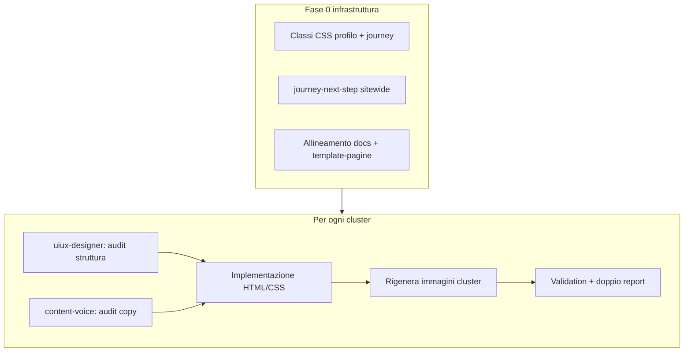

# Rigenerazione completa sito — content-voice + uiux-designer

## Contesto e obiettivo

L'architettura **percorso + wiki** è già implementata a livello strutturale (`[architecture.md](.cursor/skills/content-voice/architecture.md)`): hub dinamico, ingresso `da-dove-inizi`, nav ristrutturata, pilota profili **ansioso** (3/12). Manca la **rigenerazione sistematica** di copy, layout e coerenza UX su **tutto** il sito.

**Perimetro confermato**: tutte le ~59 pagine in `[public/](public/)` (inclusi legal, libri, cookie). **Immagini**: rigenerazione per cluster via `[scripts/prompts.json](scripts/prompts.json)` + `node scripts/generate-images.js --page=…`.

## Modello operativo: due skill in parallelo

Ogni cluster passa da un ciclo unico con responsabilità distinte (confine definito in `[uiux-designer/SKILL.md](.cursor/skills/uiux-designer/SKILL.md)` e `[content-voice/SKILL.md](.cursor/skills/content-voice/SKILL.md)`):

**Output obbligatorio per cluster** (due report separati):

- **Report UI/UX** — scala 🔴/🟡/🟢 da `[uiux-designer/checklist.md](.cursor/skills/uiux-designer/checklist.md)`
- **Report content-voice** — scala 🔴/🟡/🟢 da `[content-voice/checklist.md](.cursor/skills/content-voice/checklist.md)`

**Regole trasversali** (non negoziabili):

- Consapevolezza, mai guarigione; **Oscillante** nel testo visibile
- 70% pratico / 30% teorico; gerarchia EFT → Jung → sistemica → Process Work
- Token **Cloud Dancer** (`[themes.css](public/css/themes.css)`); niente `#fff`, niente inline `style=` sui profili
- Una CTA primaria per pagina; mobile-first; WCAG AA
- Lavoro **per cluster**, non pagina isolata

---

## Fase 0 — Infrastruttura UX (prima di toccare i contenuti)

Completare ciò che l'implementazione architetturale ha lasciato a metà:

| Intervento                                                                                | File principali                                                                                                               | Perché                                                                     |
| ----------------------------------------------------------------------------------------- | ----------------------------------------------------------------------------------------------------------------------------- | -------------------------------------------------------------------------- |
| Classi CSS per hero profilo (sostituiscono inline `style=`)                               | `[public/css/main.css](public/css/main.css)`                                                                                  | 9 profili ancora con gradienti inline                                      |
| `journey-next-step` su tutti i profili + wiki chiave                                      | `[templates/journey-next-step.html](public/templates/journey-next-step.html)`, `[journey-init.js](public/js/journey-init.js)` | Solo ansioso ha il componente oggi                                         |
| Evidenziare nav "Il tuo percorso" se `testResults`                                        | `[header.html](public/templates/header.html)`, nuovo snippet in `[nav-highlight.js](public/js/nav-highlight.js)`              | Feedback visivo post-test                                                  |
| Aggiornare `[template-pagine.md](.cursor/skills/uiux-designer/template-pagine.md)` § Home | skill uiux                                                                                                                    | Allineare al layout journey-first già in `[index.html](public/index.html)` |
| Allineare docs legacy                                                                     | `[docs/architettura-sito-wiki.md](docs/architettura-sito-wiki.md)`, `[docs/mappa-personale.md](docs/mappa-personale.md)`      | Rimuovere "guarigione", riflettere IA attuale                              |

**Gate Fase 0**: `npm run test:unit` verde; nessun regressione su journey-hub.

---

## Onde di rigenerazione (8 cluster + legal)

Ordine per **impatto utente** (allineato a `[content-voice/SKILL.md](.cursor/skills/content-voice/SKILL.md)` e `[architecture.md](.cursor/skills/content-voice/architecture.md)`):

### Onda 1 — Percorso e prima impressione (7 pagine)

**Personas**: Chiara, Luca | **Template**: `[template-pagine.md](.cursor/skills/uiux-designer/template-pagine.md)` Home, Test, Percorso

| Pagina                                                    | Focus UX                                          | Focus copy                                            |
| --------------------------------------------------------- | ------------------------------------------------- | ----------------------------------------------------- |
| `[index.html](public/index.html)`                         | Hero scansionabile, una CTA Test, 4 card ingresso | Tono compagno; profili in `
`                 |
| `[da-dove-inizi.html](public/da-dove-inizi.html)`         | 4 card persona, zero tassonomia                   | Job stories da `[jtbd/personas.md](jtbd/personas.md)` |
| `[il-tuo-percorso.html](public/il-tuo-percorso.html)`     | 3 passi visivi, fallback senza test               | Microcopy hub dinamico                                |
| `[test.html](public/test.html)`                           | Above-the-fold chiaro, disclaimer visibile        | Cosa otterrai, non è diagnosi                         |
| `[mappa-personale.html](public/mappa-personale.html)`     | Radar leggibile mobile                            | Ponte verso percorso                                  |
| `[stili-base.html](public/stili-base.html)`               | Wiki con anchor `#oscillante`                     | 4 stili, linguaggio inclusivo                         |
| `[modello-gradienti.html](public/modello-gradienti.html)` | Diagramma/scansione                               | Gradienti in parole semplici                          |

**Immagini**: aggiornare prompt cluster in `prompts.json` → rigenerare.

---

### Onda 2 — Profili evitante (3 pagine)

Applicare `[TEMPLATE-PROFILO.md](../../docs/templates/TEMPLATE-PROFILO.md)` come già fatto per ansioso:

- Hero uniformato (`Evitante alto`, badge, no MAIUSCOLO)
- `#strategie-pratiche` → `#cosa-succede` → archetipo → journey-next-step
- Disclaimer livello alto
- Rimuovere inline styles → classi BEM

Riferimenti pilota: `[ansioso-alto.html](public/profili/ansioso-alto.html)`.

---

### Onda 3 — Profili oscillante (3 pagine)

Stesso template; file URL `disorganizzato-*.html`, **testo sempre Oscillante**.

- Disclaimer obbligatorio medio-alto
- Tono visivo rassicurante (checklist uiux § profili sensibili)

---

### Onda 4 — Profili secure (3 pagine)

Stesso template; tono celebrativo ma non prescrittivo ("non sei a posto per sempre, sei risorsa").

**Gate Onde 2–4**: `npm run test:validation` (no "Disorganizzato"/"guarigione" nel visibile); 12/12 profili con journey-next-step.

---

### Onda 5 — Wiki fondamentale (3 pagine)

| Pagina                                              | UX                                          | Copy                              |
| --------------------------------------------------- | ------------------------------------------- | --------------------------------- |
| `[fondamenti.html](public/fondamenti.html)`         | Indice, blocchi corti, `.wiki-term` tooltip | Bowlby/Ainsworth accessibili      |
| `[archetipi.html](public/archetipi.html)`           | Tabella/card per archetipo                  | Ponte pratico dopo ogni archetipo |
| `[mazzo-tarocchi.html](public/mazzo-tarocchi.html)` | Navigazione tra carte                       | Metafora, non predizione          |

---

### Onda 6 — Nella relazione (3 pagine)

| Pagina                                                                | Priorità                                                             |
| --------------------------------------------------------------------- | -------------------------------------------------------------------- |
| `[dinamiche-coppia.html](public/dinamiche-coppia.html)`               | Anchor `#ansioso-evitante`; dialoghi leggibili (Sofia)               |
| `[come-supportare-partner.html](public/come-supportare-partner.html)` | Checklist step numerati (Marco)                                      |
| `[esercizi.html](public/esercizi.html)`                               | "Due minuti adesso" in evidenza; teoria in `
` |

---

### Onda 7 — Storie reali (7 pagine)

Indice `[storie-reali.html](public/storie-reali.html)` + 6 storie in `[storie-reali/](public/storie-reali/)`.

**UX**: formato narrativo scansionabile (lead, capitoletti, CTA verso percorso/test).
**Copy**: prima persona o narratore vicino; nessun lieto fine forzato; link al profilo/stile correlato.

---

### Onda 8 — Approfondimenti (13 pagine)

Indice `[approfondimenti.html](public/approfondimenti.html)` + 12 temi (lutto, tradimento, sessualità, ecc.).

**UX**: template Approfondimento — lead, 2–3 sezioni H2, box pratico, link wiki.
**Copy**: Elena/Andrea serviti con struttura; Chiara con box "in pratica" in cima.

---

### Onda 9 — Libri e risorse (12 pagine)

`[risorse.html](public/risorse.html)`, `[libri.html](public/libri.html)`, 10 schede in `[libri/](public/libri/)`.

**UX**: card uniformi, rating/pertinenza, link esterno accessibile.
**Copy**: perché leggerlo *per questo sito*; non recensione Amazon; collegamento a stile/percorso.

---

### Onda 10 — Supporto, legal, utility (5 pagine)

| Pagina                                                          | Trattamento                                         |
| --------------------------------------------------------------- | --------------------------------------------------- |
| `[quando-cercare-aiuto.html](public/quando-cercare-aiuto.html)` | Rigenerazione piena — tono compagno, segnali chiari |
| `[privacy-policy.html](public/privacy-policy.html)`             | Struttura + leggibilità; testo legale accurato      |
| `[cookie-policy.html](public/cookie-policy.html)`               | Idem                                                |
| `[termini-condizioni.html](public/termini-condizioni.html)`     | Idem                                                |

**UX legal**: heading gerarchici, sommario in cima, contrasto AA, nessun muro di testo senza paragrafi.

---

## Checklist tecnica per ogni onda

1. Leggere skill + checklist di entrambe le discipline
2. Audit UX del cluster → report 🔴/🟡/🟢
3. Audit/riscrittura copy → report 🔴/🟡/🟢
4. Implementare HTML semantico con componenti da `[componenti.md](.cursor/skills/uiux-designer/componenti.md)`
5. Aggiornare `prompts.json` se servono nuove posizioni immagine → `generate-images.js --page=…`
6. Schema.org + meta description (max ~155 char)
7. `node scripts/inject-seo.js` sul cluster
8. `npm run test:validation` + `npm run test:unit`
9. Aggiornare `[sitemap.xml](public/sitemap.xml)` se nuove pagine (improbabile)

---

## Stima e delivery

| Onda              | Pagine | Complessità                |
| ----------------- | ------ | -------------------------- |
| 0 Infrastruttura  | —      | Media                      |
| 1 Percorso        | 7      | Alta                       |
| 2–4 Profili       | 9      | Alta (template ripetibile) |
| 5 Wiki            | 3      | Media                      |
| 6 Relazione       | 3      | Alta (esercizi)            |
| 7 Storie          | 7      | Media                      |
| 8 Approfondimenti | 13     | Media                      |
| 9 Libri           | 12     | Bassa-media                |
| 10 Legal          | 5      | Bassa (struttura)          |

**Totale**: ~59 pagine editoriali + template condivisi.

Consiglio: **una PR (o commit batch) per onda** per review incrementale, non un unico diff gigante.

---

## Rischi e mitigazioni

| Rischio                        | Mitigazione                                                              |
| ------------------------------ | ------------------------------------------------------------------------ |
| Incoerenza tra cluster         | Template HTML/CSS condivisi; profili da TEMPLATE-PROFILO                 |
| Regressioni journey            | Test `[journey-hub.test.js](tests/unit/journey-hub.test.js)` a ogni onda |
| Pattern IA / termini vietati   | `[style-validator.js](tests/validation/style-validator.js)` in CI        |
| Inline styles proliferano      | Fase 0: classi `.profile-hero--`* prima dei profili                      |
| Immagini non allineate al tono | Prompt aggiornati per cluster, non rigenerazione globale                 |

---

## Criteri di done (sito completo)

- [ ] 59/59 pagine passano audit content-voice + uiux (zero 🔴 aperti)
- [ ] 12/12 profili seguono TEMPLATE-PROFILO con journey-next-step
- [ ] Zero occorrenze visibili "guarigione", "Disorganizzato"
- [ ] `npm run test:validation` e `npm run test:unit` verdi
- [ ] Immagini rigenerate per ogni cluster toccato
- [ ] Docs e skill allineati all'IA journey-first
- [ ] Banner percorso + nav highlight funzionanti end-to-end (test → hub → profilo → esercizi)