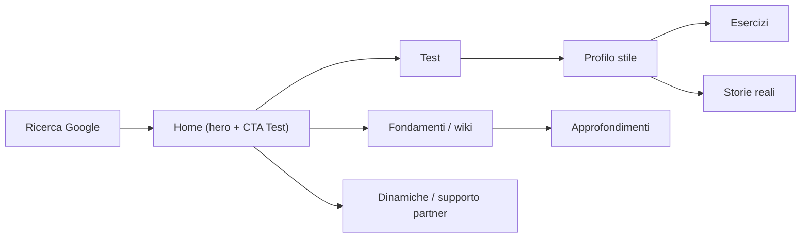

# Personas → UX — Stili di Attaccamento

Tradurre le 6 personas (`jtbd/personas.md`) in decisioni di interfaccia. **Progetta prima per Chiara e Luca** (priorita' MVP). Ogni scelta UI deve servire almeno la persona prioritaria della pagina senza penalizzare le altre.

## Quadro sintetico

| Persona | Chi | Device | Bisogno UX dominante | Priorita' |
|---------|-----|--------|----------------------|-----------|
| Chiara — la curiosa | 28, vuole capirsi senza sentirsi sbagliata | Mobile | Capire in fretta, sentirsi validata | **Alta (MVP)** |
| Luca — vulnerabile | 31, relazioni che falliscono, si sente "rotto" | Mobile | Speranza, calma, percorso chiaro | **Alta (MVP)** |
| Marco — il pratico | 35, ingegnere, poca teoria | Desktop | Step concreti, checklist | Media |
| Sofia — la partner | 29, vuole supportare il partner | Mobile | Sezioni dedicate, esempi di dialogo | Media |
| Elena — la consapevole | 42, professionista | Mobile+Desktop | Struttura wiki, fonti, navigazione | Bassa |
| Andrea — il ricercatore | 38, interesse accademico | Desktop | Profondita', riferimenti, indice | Bassa |

---

## Chiara — la curiosa (prioritaria)

- **Contesto UI**: arriva da ricerca Google, su mobile, scansiona velocemente.
- **Implicazioni**:
  - Mobile-first reale: tap target ≥44px, testo ≥16px, niente hover-only.
  - Above-the-fold chiaro: cosa e' il sito + CTA Test in evidenza.
  - Contenuti scansionabili: lead breve, sottotitoli (Playfair), liste compatte.
  - Tono visivo validante: Cloud Dancer caldo, niente rosso allarmante, niente giudizio grafico.
  - Percorso: Home → Test → Profilo → Esercizi senza vicoli ciechi (usa `.content-nav`).
- **Pain da evitare**: muri di testo, gergo non spiegato (usa `.wiki-term`), pagine lunghe e disperse.

## Luca — vulnerabile (prioritaria)

- **Contesto UI**: stato emotivo fragile, cerca conforto e speranza, mobile.
- **Implicazioni**:
  - Estetica rassicurante: superfici morbide, spazio bianco generoso, ritmo lento.
  - Nessun toni allarmante: l'unico rosso e' per errori reali; i profili "Alto"/Oscillante usano colore + disclaimer empatico, non drammatico.
  - Percorso evidente e breve: max una decisione per schermata.
  - Le Storie reali sono per lui: facili da raggiungere, leggibili, terza persona.
- **Pain da evitare**: linguaggio/colore stigmatizzante, dead-end senza "e adesso?".

## Marco — il pratico

- **Implicazioni**:
  - "Cosa fare" prima del "perche'": step numerati, checklist, durata visibile.
  - Banner/azioni con tempo stimato (`.banner-horizontal__time`).
  - Desktop ok: griglie a 2-3 colonne, scansione rapida.
- **Pain da evitare**: troppa teoria, copy "touchy-feely" senza azione.

## Sofia — la partner

- **Implicazioni**:
  - Sezioni dedicate "Come supportare il partner" e "Dinamiche di coppia" ben raggiungibili dal menu.
  - Esempi di dialogo leggibili (puoi usare `.card--mono` o blocchi citazione) con struttura "cosa dire / cosa evitare".
  - Tono non colpevolizzante: nessuna grafica che "accusa" un lato della coppia.
- **Pain da evitare**: contenuti che fanno sentire in colpa; mancanza di esempi concreti.

## Elena & Andrea — esperti

- **Implicazioni**:
  - Struttura wiki solida: breadcrumb sempre presente, indice/menu con submenu, naming coerente delle pagine.
  - Navigazione sistematica: link correlati, sezioni ancorabili, gerarchia heading pulita.
  - Fonti e riferimenti visibili (pagine libri/risorse, citazioni).
  - Desktop: leggibilita' su righe lunghe → mantenere max-width del testo.
- **Pain da evitare**: contenuti superficiali, struttura confusa, fonti assenti.

---

## Mappa journey → pagine → componenti

| Tappa | Persona servita | CTA primaria | Componenti chiave |
|-------|-----------------|--------------|-------------------|
| Home | Chiara, Luca | Fai il test | `.hero`, `.grid-3` di `.card` |
| Test | Chiara, Marco | Vedi il tuo profilo | form accessibile, `.wiki-lead`, disclaimer |
| Profilo | Chiara, Luca | Prova un esercizio | `.style-section--*`, `.content-nav` |
| Esercizi | Marco | (resta sulla pratica) | `.card`, step `ol`, badge tempo |
| Storie | Luca | (validazione) | narrazione, `.wiki-image` |
| Wiki/Approf. | Elena, Andrea | (approfondisci) | `.wiki-*`, `.blog-card`, breadcrumb |
| Relazioni | Sofia | (capire/agire) | `.style-section`, esempi dialogo |

---

## Principi guida (sintesi operativa)

1. **Una persona prioritaria per pagina**: decidi chi servi prima e ottimizza per lei.
2. **Calma > densita'**: meglio una pagina ariosa che completa ma soffocante.
3. **Mai dead-end**: ogni pagina offre un passo successivo (`.content-nav`).
4. **Validazione, non diagnosi**: il colore e il tono comunicano "sei ok", il copy lo conferma (vedi `content-voice`).
5. **Coerenza tra pagine sorelle**: stesso template e ritmo nei cluster.
